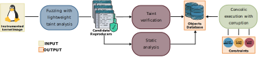

> ⚠️ **Warning**
>
> This repository uses **Git Large File Storage (Git LFS)**.  
> You must install Git LFS before cloning or checking out the repository, otherwise some files will be missing or replaced with pointer files.
>
> Installation instructions: https://git-lfs.github.com/
>
> After installing, run:
> ```bash
> git lfs install
> ```
>
> Then you can safely clone the repository.


# CopyKat


 
This repository contains the code to replicate the findings of our Usenix Security 2026 paper:

"Discovering, characterizing and exploiting controllable-copy objects for kernel data-only attacks with CopyKat"

Authors:

Jakob Koschel, IBM Research Europe - Zurich
Andrea Mambretti, IBM Research Europe - Zurich
Alessandro Sorniotti, IBM Research Europe - Zurich
Pietro Moretto, IBM Research Europe - Zurich
Claudio Migliorelli, IBM Research Europe - Zurich
Andrea Di Dio, Vrije Univesiteit Amsterdam
Cristiano Giuffrida, Vrije Univesiteit Amsterdam
Anil Kurmus, IBM Research Europe - Zurich


We provide our two main components: the `taint_verification` and the `concolic_execution_with_corruption` components (see figure).


## Taint verification 

The taint verification component takes as input the `Candidate Reproducers` that our fuzzing campaign has collected, and produces in output the `Object Database`.
This component uses the Panda taint analysis engine to perform object verification.

## Concolic execution with corruption

This component takes in input both, the `Candidate Reproducers` and the `Object Database` and run them through concolic execution. 
Within each run, we simulate the corruption of the object as the attacker and we verify that the reproducer successufully reaches our sink, the memory operation.
As output, it provides a set of constraints in KQuery format and a report file with information w.r.t. if, after corruption, the controllability of the memory operation is still valid.
This component uses S2E as main engine for the analysis.

